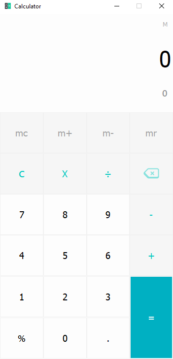

# Calculator v3.0

## About it
This program is written in pyQt5 python. its GUI is created in pydesigner. Ideo of its designed was taken by the calculator of honor 8C phone. This version has more features:

- `Modern Ui`: Its user's interface(UI) is better than all previous versions of calculator. It is simple, colorful and more detailed. It also contains hover feature and accessiable by keyboard keys. 
- `More Accurate:` It is more accurate and it has more features than its previous versions.
- `Light Weight:` it is light weight software which make it more fast then other calculators. it's total space consucption is less than 2 MB.